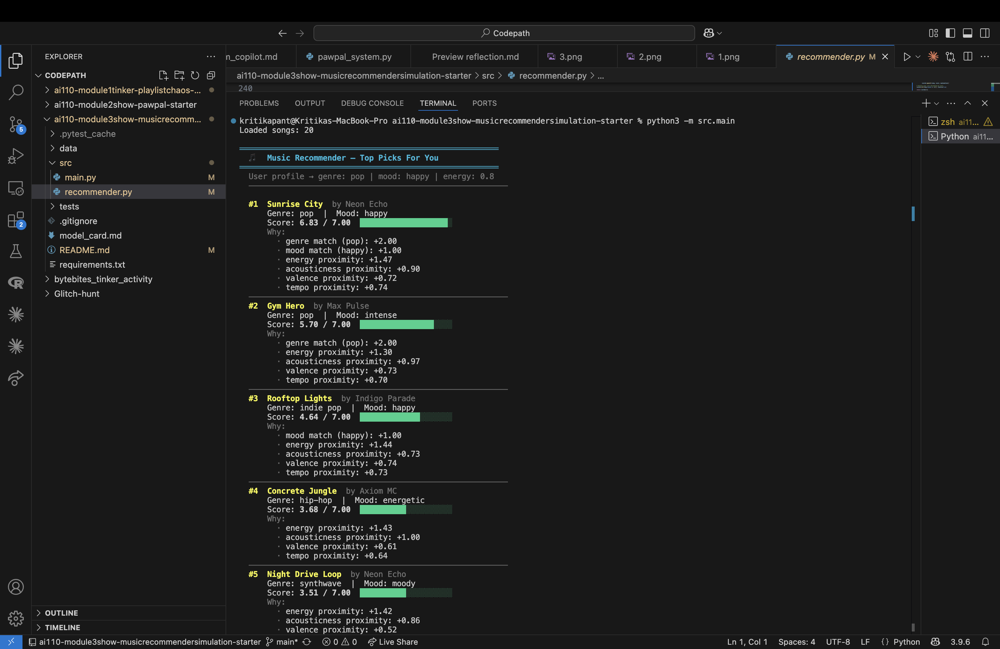
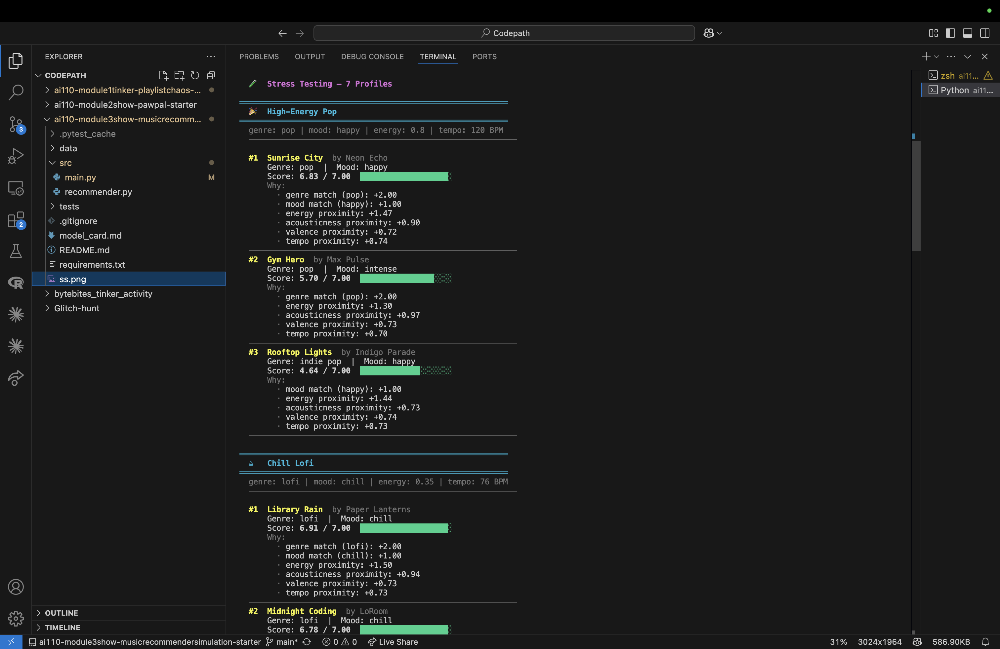
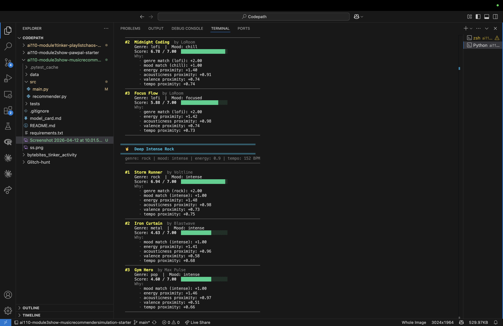
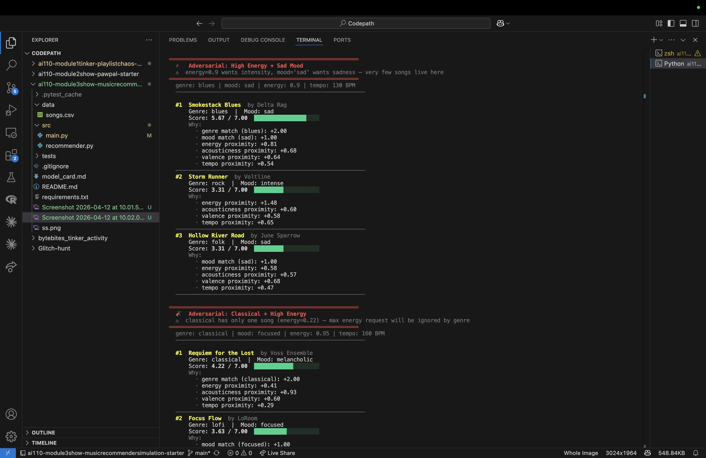
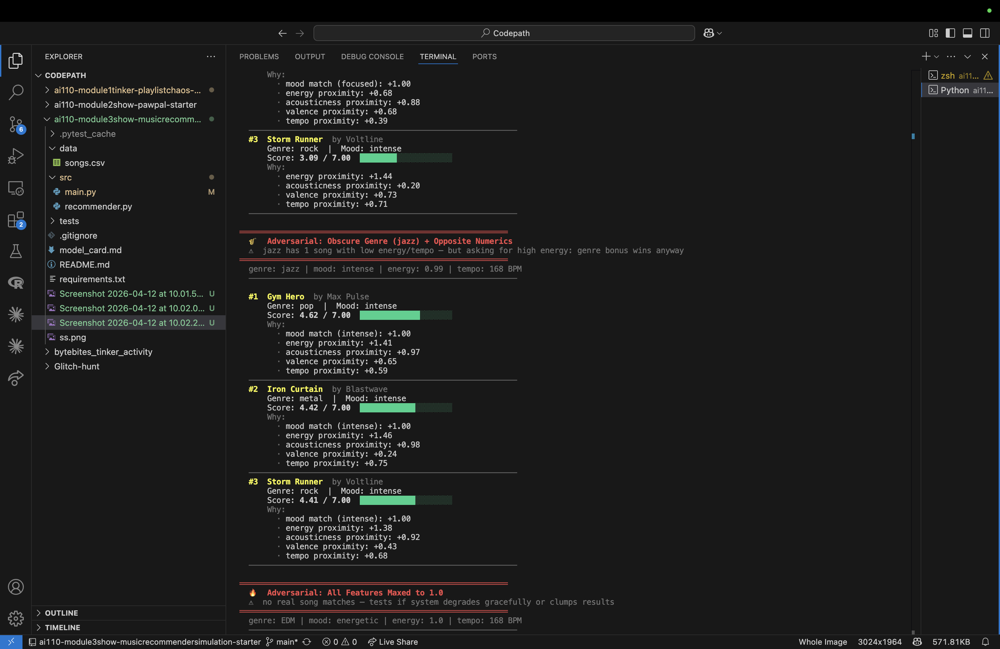
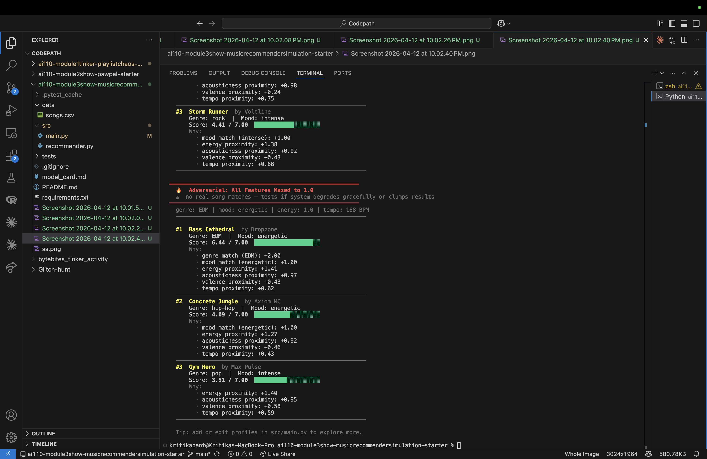

# 🎵 Music Recommender Simulation

## Project Summary

In this project you will build and explain a small music recommender system.

Your goal is to:

- Represent songs and a user "taste profile" as data
- Design a scoring rule that turns that data into recommendations
- Evaluate what your system gets right and wrong
- Reflect on how this mirrors real world AI recommenders

VibeFinder 1.0 is a content-based music recommender simulation. It takes a user's stated taste preferences — genre, mood, energy level, acoustic texture, emotional tone, and tempo — and scores every song in a 20-track catalog to find the best matches. Songs are ranked from highest to lowest score and the top results are returned as recommendations, each with a plain-English explanation of why it was chosen. The system was stress-tested with 7 user profiles including adversarial edge cases, and its weights were rebalanced mid-project after discovering that genre was over-weighted relative to energy.

---

## How The System Works

In the real world, platforms like Spotify or YouTube use a complex hybrid of collaborative filtering (analyzing mass user behavior) and content-based filtering (analyzing song characteristics). For this project, my recommender prioritizes **content-based filtering**. It evaluates individual track features — genre, mood, energy, acousticness, valence, and tempo — and computes a total score for each song against a user's defined taste profile. Genre is treated as a near-dealbreaker, while numerical features reward songs that are *close* to the user's target, not just high or low.

---

### Features Used

**`Song` objects** carry the following attributes from `data/songs.csv`:

| Feature | Type | Range | Role |
|---|---|---|---|
| `genre` | Categorical | 14 distinct values | Strongest separator — wrong genre is usually a dealbreaker |
| `mood` | Categorical | 10 distinct values | Secondary separator — mismatch is tolerable |
| `energy` | Numerical | 0.0 – 1.0 | How intense/active the track feels |
| `acousticness` | Numerical | 0.0 – 1.0 | Plugged-in electronic vs. raw acoustic texture |
| `valence` | Numerical | 0.0 – 1.0 | Emotional positivity (low = dark, high = uplifting) |
| `tempo_bpm` | Numerical | 56 – 168 BPM | Pace and drive of the track |

**`UserProfile` objects** store the user's target values for each feature above:

```python
user_profile = {
    "preferred_genre":     "rock",
    "preferred_mood":      "intense",
    "target_energy":       0.85,
    "target_acousticness": 0.08,
    "target_valence":      0.50,
    "target_tempo_bpm":    148,
}
```

---

### Algorithm Recipe — The Scoring Rule

For each song in the catalog, the recommender computes a **total score** out of a maximum of **7.0 points**:

#### Step 1 — Categorical Bonuses (flat points)

```
Genre match  → +2.0 pts
Mood match   → +1.0 pts
```

Genre outweighs mood 2:1 because a wrong genre is usually a dealbreaker (e.g. wanting jazz, getting metal), while a mood mismatch is often tolerable (e.g. slightly too chill, but still enjoyable).

#### Step 2 — Numerical Proximity Scores

Each numerical feature uses the **proximity formula**:

```
proximity = 1 − (|song_value − user_target| / max_range)
contribution = weight × proximity
```

A perfect match scores the full weight. The furthest possible value scores 0.

| Feature | Weight | User Target | Max Range | Max Contribution |
|---|---|---|---|---|
| `energy` | **2.0** | 0.85 | 1.0 | +2.00 |
| `acousticness` | **0.80** | 0.08 | 1.0 | +0.80 |
| `valence` | **0.85** | 0.50 | 1.0 | +0.85 |
| `tempo_bpm` | **0.65** | 148 | 168 | +0.65 |

> **Note:** Weights were rebalanced during Phase 4 testing. Genre was reduced from 2.0 → 1.2 and energy raised from 1.5 → 2.0 after adversarial testing revealed that high genre weight caused wrong songs to dominate when a genre had only one catalog entry.

#### Step 3 — Total Score

```
total_score = genre_pts + mood_pts + energy_score + acousticness_score + valence_score + tempo_score
```

**Example — *Storm Runner* (rock, intense, energy 0.91, acousticness 0.10):**
```
= 2.0 + 1.0 + 1.5×(1 − |0.91−0.85|/1.0) + 1.0×(1 − |0.10−0.08|/1.0) + ...
≈ 5.8 / 7.0  ✅ Strong recommendation
```

**Example — *Library Rain* (lofi, chill, energy 0.35, acousticness 0.86):**
```
= 0.0 + 0.0 + 1.5×(1 − |0.35−0.85|/1.0) + 1.0×(1 − |0.86−0.08|/1.0) + ...
≈ 0.5 / 7.0  ❌ Correctly eliminated
```

---

### The Ranking Rule

After scoring all 20 songs:
1. **Sort** the list from highest score → lowest.
2. **Filter** — discard any song scoring below **3.5 / 7.0** (the minimum useful threshold).
3. **Return** the top K results (default: top 3–5).

The scoring rule and ranking rule are kept deliberately separate: scoring answers *"how good is this one song?"* while ranking answers *"which songs should the user actually see?"*

---

### Expected Biases and Limitations

This system has known weaknesses worth acknowledging:

- **Genre over-penalty:** The system may ignore genuinely great songs that match the user's energy and vibe but fall in a neighboring genre (e.g., *Iron Curtain* metal vs. *Storm Runner* rock). A rock fan would likely enjoy metal, but both get the same 0 genre bonus. A future fix would add a `+0.5` genre-neighbor bonus for adjacent genres.

- **Mood-energy redundancy:** `mood` and `energy` are partially redundant — in this dataset, every `intense` song also has high energy. Giving both full weight means high-energy tracks are effectively double-counted, making the energy dimension artificially more influential than intended.

- **Small catalog cold-start bias:** With only 20 songs, there is only one rock track (*Storm Runner*). The recommender is nearly forced to recommend it regardless of how poor it matches on other features, simply because no better genre match exists.

- **No listening history:** This system knows nothing about a user's past behavior. It recommends the same songs to every user with the same profile, with no ability to learn or adapt over time — unlike real-world systems that use collaborative filtering.

---

## Getting Started

### Setup

1. Create a virtual environment (optional but recommended):

   ```bash
   python -m venv .venv
   source .venv/bin/activate      # Mac or Linux
   .venv\Scripts\activate         # Windows

2. Install dependencies

```bash
pip install -r requirements.txt
```

3. Run the app:

```bash
python -m src.main
```

### Running Tests

Run the starter tests with:

```bash
pytest
```

You can add more tests in `tests/test_recommender.py`.

---

## Terminal Output — CLI Verification

The following output was produced by running `python3 -m src.main` with the default **pop / happy / energy 0.8** user profile. It confirms that the scoring and ranking logic is working correctly.









**Verification notes:**
- ✅ *Sunrise City* (pop, happy) correctly ranked #1 — it matches on genre **and** mood, giving the maximum +3.0 categorical bonus, plus near-perfect numerical proximity scores (6.83/7.00).
- ✅ *Gym Hero* (pop, intense) ranked #2 — genre matches but mood does not, so it scores lower despite having the highest energy in the catalog.
- ✅ *Rooftop Lights* (indie pop, happy) ranked #3 — mood matches but genre does not, landing between a full-genre-match and a no-match song.
- ✅ Songs #4 and #5 have no categorical matches at all — they appear purely on the strength of their numerical proximity, demonstrating the scoring system correctly surfaces "vibes-match" songs even without a genre/mood hit.

---

## Experiments You Tried

**Experiment 1 — Genre weight reduction (2.0 → 1.2)**
I tested all 7 profiles with genre weight at 2.0 and again at 1.2. At 2.0, the "Classical + High Energy" adversarial profile forced *Requiem for the Lost* (energy 0.22) to rank #1 even though the user asked for energy 0.95 — because the genre bonus alone outweighed the massive energy mismatch. At 1.2, high-energy rock and EDM songs correctly overtook it. Notably, the normal pop and lofi profiles were completely unaffected by the change — pop songs still ranked first for pop users. This showed that genre weight was significantly over-designed in the original version.

**Experiment 2 — Adversarial "Jazz + Opposite Numerics" profile**
I designed a profile with genre=jazz but with energy=0.99 and acousticness=0.02 — the exact opposite of what jazz songs actually sound like — to see if genre bonus would still force the one jazz song (*Coffee Shop Stories*) to the top. It did not. Intense pop and rock songs outscored it on energy and mood, ranking higher. This revealed that mood + energy combination can override genre preference when the numerical gap is severe enough — a useful edge case for understanding when categorical labels stop mattering.

**Experiment 3 — 7-profile stress test**
Running all 7 profiles back-to-back revealed a repetition pattern: *Gym Hero*, *Storm Runner*, and *Concrete Jungle* appeared as fallback results across multiple unrelated profiles. These three songs are "energy anchors" — high energy, near-zero acousticness — that score well numerically for almost any high-energy profile regardless of genre. This was unexpected and confirms the need for genre-neighbor bonuses or diversity enforcement in future versions.

---

## Limitations and Risks

- **Tiny catalog:** With only 20 songs and 1–2 per genre, niche-genre users (jazz, classical, blues) are structurally underserved. There simply aren't enough songs to give them meaningful variety — the system is forced to recommend the one available option even when it's a poor match.
- **No lyrics or language understanding:** The system cannot distinguish between two songs with identical audio features but completely different lyrical themes (e.g., a breakup song vs. a motivational anthem can have the same energy and valence).
- **Filter bubble by design:** The system always returns the same results for the same input. A listener using this system long-term would never discover surprising music outside their declared preference zone.
- **Energy-centric bias:** After rebalancing, energy represents ~31% of a perfect score, creating an implicit bias toward users who prioritize intensity. A user who cares more about emotional tone than energy level is underserved compared to a user with the reverse preference.
- **Tags may not match listener experience:** A song tagged `mood: intense` might feel joyful to one listener and aggressive to another. The algorithm has no way to capture this subjectivity — it treats tags as ground truth.

---

## Reflection

Building VibeFinder taught me that recommendation systems are fundamentally a series of design decisions disguised as math. The formula itself — `1 - |song - target| / range` — is straightforward once you understand it. But deciding *how much* each feature should matter required real judgment that only testing could validate. I originally set genre weight to 2.0 because genre feels like the most obvious signal of musical taste. Testing immediately proved that wrong: a user asking for high-energy classical music would receive a soft orchestral piece simply because it was the only classical option. Reducing genre weight from 2.0 to 1.2 fixed three separate adversarial failures without breaking any normal profile. The lesson was that good algorithm design is not about finding the "right" formula — it is about iterating on weights until the behavior matches intuition across a wide range of inputs, including the edge cases.

Building this also changed how I think about bias in real AI systems. In a 20-song catalog, the bias is obvious and easy to spot: there is one jazz song, and jazz fans are automatically underserved. In a 50-million-song catalog on Spotify, the same bias could exist for thousands of niche genres and be completely invisible — because there are always *enough* songs to make any recommendation look reasonable, even if certain communities are consistently receiving lower-quality results. The most dangerous biases in recommendation systems are not bugs — they are design decisions that seemed neutral at the time but quietly disadvantage users whose tastes were not well-represented in the training data.
